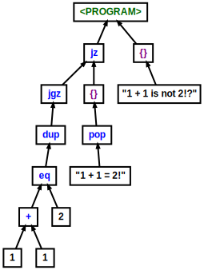

# Tzo-Analyze

<span><a href="https://npmjs.org/package/tzo-analyze" title="View this project on NPM"></a></span>

Analyze [Tzo](https://github.com/jorisvddonk/tzo) code (Standard Representation and ConciseText formats) and emit various details/statistics/formats.

Currently, the main thing this does is analyze Tzo code and return a nice syntax tree.

Can also be used as a library and imported.

## Running

1. make sure you have dependencies installed: `npm i`
2. `npm run start -- --input <path to Tzo VMState .json or Tzo conciseText .txt file> --output out.json`

to output a GraphViz .dot file for the Syntax Tree, use the `--dot <PATH>` parameter.

## Unit tests

To run the unit tests: `npm test`

## Example Syntax Tree graphs

(blue: function/opcode, black: literal, purple: block, green: root)

### if/else

```
1 1 + 2 eq dup jgz {
  "1 + 1 = 2!" pop
} jz {
  "1 + 1 is not 2!?"
}
```

